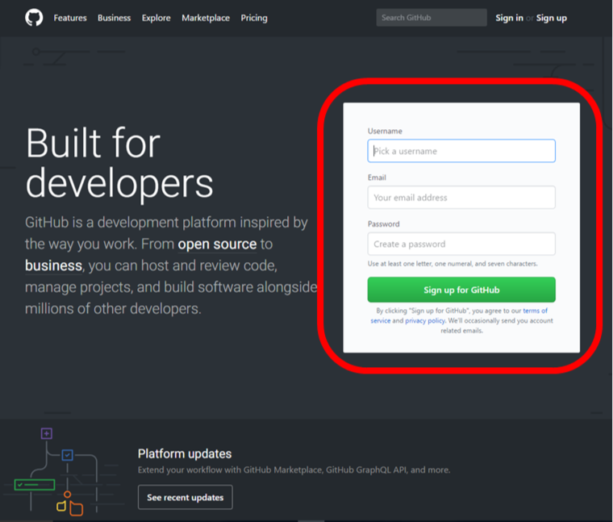
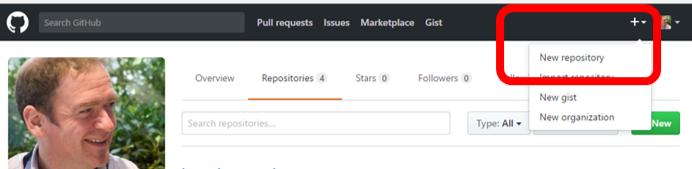
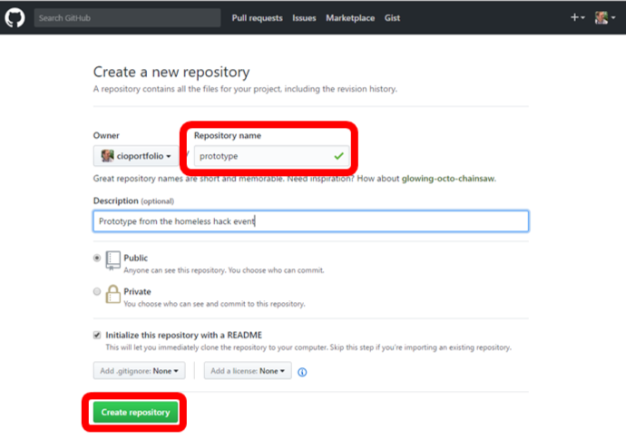
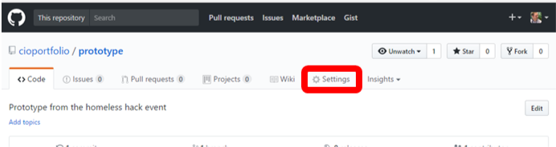
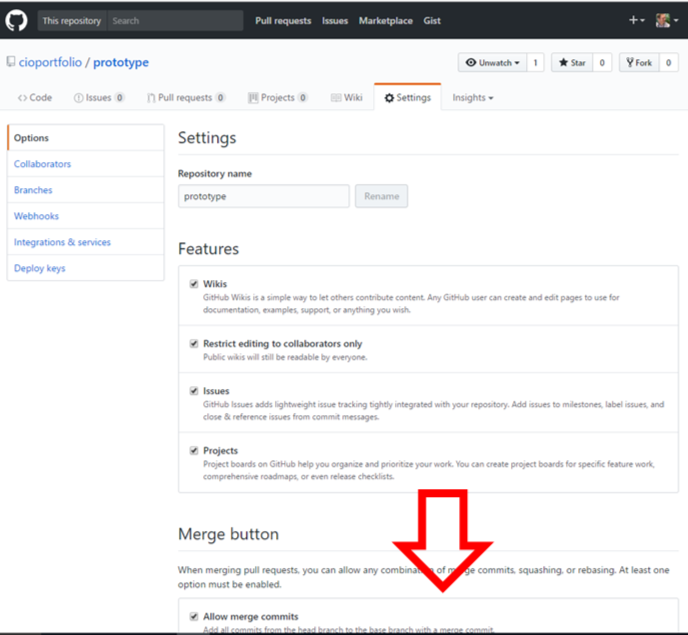
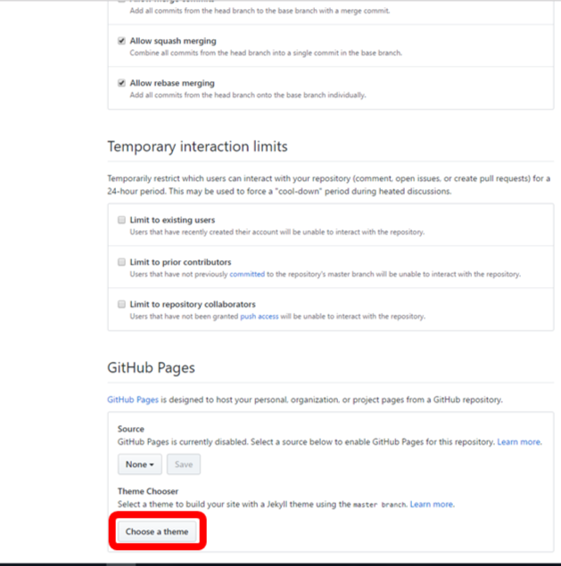
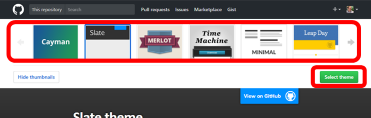
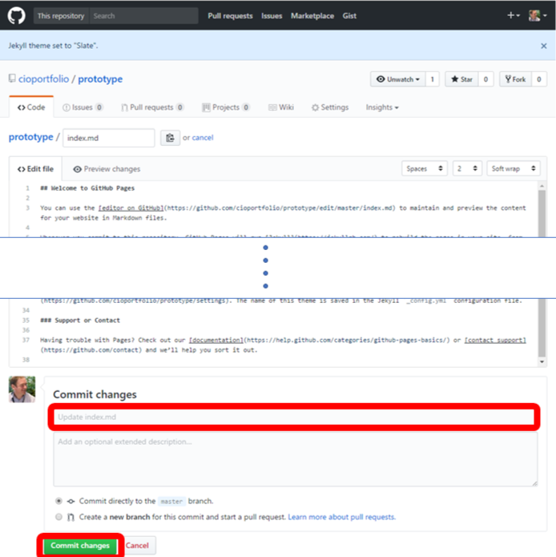
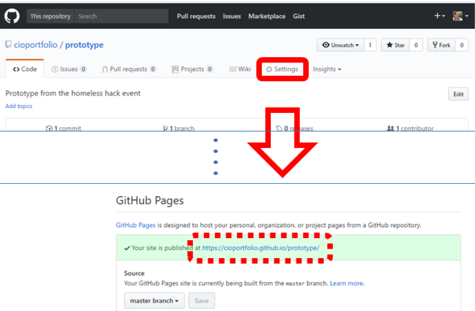

> [Also see the main #homelesshack pages](homelesshack.github.io)

## 30 Second Prototypes

**Remember:** You don't need any IT to start prototyping. Pens and paper are quick and easy or you could even use a smart phone to film yourself acting out a scenario!

You don't need a lot of IT equipment or loads of technical skills to create prototypes. You can grab some [images](https://www.google.co.uk/search?q=smartphone+vector+free+download&tbm=isch) from the web and create a story boards in your favourite presentation software. For a similar amount of effort you can create something that you can share online and people can try on their computer or mobile phone. Why not give it a try?

### Sign up for GitHub

Head to [GitHub](https://github.com) and sign up for an account.

### Create a space for your prototype

These are called "repositories" in GitHub and you can create them from a drop down menu at the top of the GitHub page for your account.

Think of a short memorable name for the respository as this will be part of the web link for the prototype later.

### Create a template website

You can create a simple website from the settings menu of your new repository.

You will need to scroll down to the bottom to find the website settings.

Choose a template and use the button to create a basic site. You can change the template in the repository settings if you change your mind later.

### Edit the content of your site
Now you can edit the contents of your website. The default page includes some examples of the simple markup language that it uses to get you started. Each time you commit a change GitHub will take a few seconds to republish the site.

### Try out your new site and share the link
Your site is now on the internet! You can find a link to the site from the repository settings page.

There are [loads of things](https://pages.github.com/) that you can try with this site and the GitHub repository including sharing with a team, collaborating on changes and adding other software. If you want to go further GDS have created a great [prototype kit](https://govuk-prototype-kit.herokuapp.com/docs/install/introduction).
